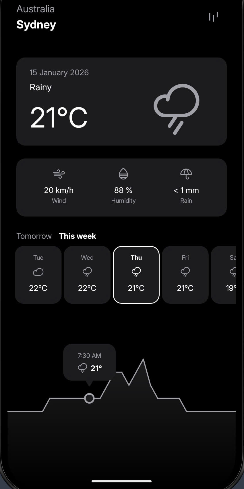

# Weather App

A simple Android weather application built with Kotlin, following Clean Architecture principles and MVVM pattern.

## Architecture

Clean Architecture with MVVM pattern (Data, Domain, Presentation layers).

## Tech Stack

- **Kotlin**, **Android SDK**
- **Hilt** - Dependency injection
- **Retrofit**, **Moshi** - Networking and JSON parsing
- **DataStore Preferences** - Local storage
- **Material Design Components**, **Navigation Component**, **View Binding**, **Data Binding**
- **Kotlin Coroutines**, **Flow** - Asynchronous programming
- **Google Play Services Location** - GPS location

## API Provider

Weather data provided by [WeatherAPI.com](https://www.weatherapi.com/).

## Screenshots

